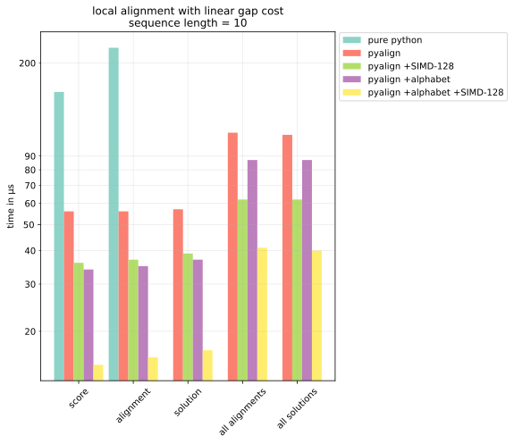
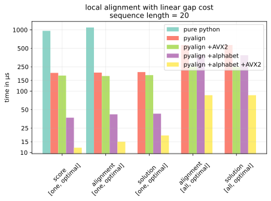
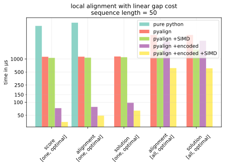

# pyalign

Fast and simple alignments in Python:


<hr>

Alignments have been a staple algorithm in bioinformatics for decades now,
but most packages implementing tend to be either easy to use and slow, or
fast but very difficult to use and highly domain specific.

pyalign is a small and hopefully rather versatile Python package that aims to
be fast and easy to use. At its core, it is an optimizer for finding "optimum
correspondences between sequences" (Kruskal, 1983) - the main proponents of which
are alignments and dynamic time warping.

General Features:

* easy to install and easy to use
* robust and efficient implementation of standard algorithms
* very fast for smaller problem sizes (see below for details)
* built-in visualization functionality for teaching purposes

In terms of alignment algorithms:

* computes local, global and semiglobal alignments on pairs of sequences
* supports different gap costs (commonly used ones as well as custom ones)
* automatically selects best suitable algorithm (e.g. Gotoh)
* no assumptions on matched items, i.e. not limited to characters
* supports any given similarity or distance function (i.e. can maximize or minimize)
* can return one as well as *all* optimal alignments and scores

The implementation should be rather fast due to highly optimized code paths
for every special case. While it does *not* support GPUs, here are some facts:

* optimized C++ core employing <a href="https://github.com/xtensor-stack/xtensor">xtensor</a>
* supports SIMD via batching (i.e. simple SIMD parallelism as first
suggested by Alpern et al. and more recently by Rudnicki et al.)
* carefully designed to avoid dynamic memory allocation
* extensive metaprogramming to provide different optimized code paths for different
usage patterns - for example, computing "only single score" won't write tracebacks,
whereas computing "all alignments" will track multiple traceback edges

# Installation

`pip install pyalign`

# Example

Running

```python
import pyalign
alignment = pyalign.global_alignment("INDUSTRY", "INTEREST", gap_cost=0, eq=1, ne=-1)
alignment
```

will compute an optimal global alignment between "INDUSTRY" and "INTEREST".

We instruct the optimizer to use of scores 1 and -1 (for matching and non-matching letters) and no (i.e. 0) gap costs.

In Jupyter, this will give

```
IN----DUSTRY
||      ||  
INTERE--ST--
```

Of course you can also extract the actual score:

```python
alignment.score
```

as

```python
2.4
```

It's also possible to extract the traceback matrix and path and generate
visuals (and thus a detailed rationale for the obtained score and solution).

In contrast to the first example above, which used the simplified high level
API, we now use the full, more detailed API, which gives much more detailed
access to different gap costs, solvers and scoring configurations. To make
things a bit more interesting, we switch from 0 gap cost to 0.2 (which will
not  change the result in this case, but shows in the traceback matrix):

```python
import pyalign.problems
import pyalign.solve
import pyalign.gaps

pf = pyalign.problems.general(
    pyalign.problems.Equality(eq=1, ne=-1),
    direction="maximize")
solver = pyalign.solve.GlobalSolver(
    gap_cost=pyalign.gaps.LinearGapCost(0.2),
    codomain=pyalign.solve.Solution)
problem = pf.new_problem("INDUSTRY", "INTEREST")
solver.solve(problem)
```


As a final example, here is how we would modify the `solver` above to get a list over all optimal
solutions of a problem:

```python
from typing import Iterator

solver = pyalign.solve.GlobalSolver(
    gap_cost=pyalign.gaps.LinearGapCost(0.2),
    codomain=List[pyalign.solve.Solution])
```

This will now return a list of solutions, each with its own traceback, e.g.:

```python
[<pyalign.solve.Solution at 0x10f0f15b0>,
 <pyalign.solve.Solution at 0x10f0f1580>]
```

To learn more about the API, take a look at

[](https://mybinder.org/v2/gh/poke1024/pyalign-demo/HEAD?filepath=example.ipynb)

# Performance

Here are a few benchmarks. The "pure python" implementation seen in this
benchmark is found at https://github.com/eseraygun/python-alignment.

The y axis is logarithmic. 1000 μs = 1 / 1000 s.

`+alphabet` means using `pyalign.problems.alphabetic` instead of
the simpler `pyalign.problems.general` to construct a problem.

`+SIMD` means feeding groups of equally-structured aligment problems into
one `solve` call by using `pyalign.problem.ProblemBatch` - doing this will
internally make use of [AVX2](https://en.wikipedia.org/wiki/Advanced_Vector_Extensions)
on Intel and [Neon](https://developer.arm.com/technologies/neon) on ARM processors.

The following benchmarks were done on an Apple M1 Max. SIMD-128 refers to the M1's 128-bit SIMD.

The benchmark code can be found under [benchmark.py](demo/py/benchmark.py).







# Other Alignment Libraries

Here is a short overview of other libraries.

## similar to pyalign

* https://edist.readthedocs.io/en/latest/
* https://pypi.org/project/textdistance/
* https://github.com/mbreese/swalign/
* https://github.com/seqan/seqan3
* https://github.com/wannesm/dtaidistance

## for large scale problems

What you will *not* find in pyalign:

* SIMD acceleration for single pairs of sequences as in e.g. (Farrar 2007)
* GPU acceleration, see e.g. (Barnes, 2020)
* approximate or randomized algorithms
* advanced preprocessing or indexing

If you need any of the above, you might want to take a look at:

* http://cudasw.sourceforge.net/homepage.htm
* https://blast.ncbi.nlm.nih.gov/Blast.cgi

# References

## Original Works

Altschul, S. (1998). Generalized affine gap costs for protein sequence alignment. Proteins: Structure, 32.

Gotoh, O. (1982). An improved algorithm for matching biological sequences. Journal of Molecular Biology, 162(3), 705–708. https://doi.org/10.1016/0022-2836(82)90398-9

Sankoff, D. (1972). Matching Sequences under Deletion/Insertion Constraints. Proceedings of
the National Academy of Sciences, 69(1), 4–6. https://doi.org/10.1073/pnas.69.1.4

Smith, T. F., & Waterman, M. S. (1981). Identification of common
molecular subsequences. Journal of Molecular Biology, 147(1), 195–197.
https://doi.org/10.1016/0022-2836(81)90087-5

Miller, W., & Myers, E. W. (1988). Sequence comparison with concave weighting functions. Bulletin of Mathematical Biology, 50(2), 97–120. https://doi.org/10.1007/BF02459948

Needleman, S. B., & Wunsch, C. D. (1970). A general method applicable
to the search for similarities in the amino acid sequence of two proteins.
Journal of Molecular Biology, 48(3), 443–453. https://doi.org/10.1016/0022-2836(70)90057-4

Waterman, M. S., Smith, T. F., & Beyer, W. A. (1976). Some biological sequence metrics.
Advances in Mathematics, 20(3), 367–387. https://doi.org/10.1016/0001-8708(76)90202-4

Waterman, M. S. (1984). Efficient sequence alignment algorithms. Journal of Theoretical Biology, 108(3), 333–337. https://doi.org/10.1016/S0022-5193(84)80037-5

## Other Algorithms

Chakraborty, A., & Bandyopadhyay, S. (2013). FOGSAA: Fast Optimal Global Sequence Alignment Algorithm. Scientific Reports, 3(1), 1746. https://doi.org/10.1038/srep01746

## Surveys

Aluru, S. (Ed.). (2005). Handbook of Computational Molecular Biology.
Chapman and Hall/CRC. https://doi.org/10.1201/9781420036275

Stojmirović, A., & Yu, Y.-K. (2009). Geometric Aspects of Biological Sequence Comparison. Journal of Computational Biology, 16(4), 579–610. https://doi.org/10.1089/cmb.2008.0100

Kruskal, J. B. (1983). An Overview of Sequence Comparison: Time Warps,
String Edits, and Macromolecules. SIAM Review, 25(2), 201–237. https://doi.org/10.1137/1025045

Müller, M. (2007). Information Retrieval for Music and Motion. Springer Berlin Heidelberg. https://doi.org/10.1007/978-3-540-74048-3

## Implementations

Alpern, B., Carter, L., & Su Gatlin, K. (1995). Microparallelism and high-performance protein matching. Proceedings of the 1995 ACM/IEEE Conference on Supercomputing (CDROM)  - Supercomputing ’95, 24-es. https://doi.org/10.1145/224170.224222

Barnes, R. (2020). A Review of the Smith-Waterman GPU Landscape. https://www2.eecs.berkeley.edu/Pubs/TechRpts/2020/EECS-2020-152.html

Farrar, M. (2007). Striped Smith-Waterman speeds database searches six times over other SIMD implementations. Bioinformatics, 23(2), 156–161. https://doi.org/10.1093/bioinformatics/btl582

Flouri, T., Kobert, K., Rognes, T., & Stamatakis, A. (2015). Are all global alignment algorithms and implementations correct? [Preprint]. Bioinformatics. https://doi.org/10.1101/031500

Rognes, T. (2011). Faster Smith-Waterman database searches with inter-sequence SIMD parallelisation. BMC Bioinformatics, 12(1), 221. https://doi.org/10.1186/1471-2105-12-221

Rudnicki, W. R., Jankowski, A., Modzelewski, A., Piotrowski, A., & Zadrożny, A. (2009). The new SIMD Implementation of the Smith-Waterman Algorithm on Cell Microprocessor. Fundamenta Informaticae, 96(1–2), 181–194. https://doi.org/10.3233/FI-2009-173

Tran, T. T., Liu, Y., & Schmidt, B. (2016). Bit-parallel approximate pattern matching: Kepler GPU versus Xeon Phi. 26th International Symposium on Computer Architecture and High Performance Computing, 54, 128–138. https://doi.org/10.1016/j.parco.2015.11.001
