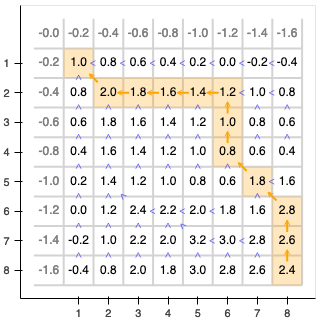

# pyalign

pyalign is a small and hopefully rather versatile Python package
for finding "optimum correspondences between sequences" (Kruskal, 1983),
the main proponents of which are alignments and dynamic time warping.

Features:

* easy to install and easy to use
* robust and efficient implementation of standard algorithms
* computes local, global and semiglobal alignments on pairs of sequences
* supports different gap costs( commonly used ones as well as custom ones)
* automatically selects best suitable algorithm
* no assumptions on matched items, i.e. not limited to characters
* supports any given similarity function
* reasonably fast for smaller problem sizes (see below for details)
* built-in visualization functionality for teaching purposes

What you will *not* find in pyalign:

* multiple or all best alignments. At the moment, pyalign only
returns one best alignment
* advanced algorithms - the implemented algorithms are O(n^2)
and O(n^3), you won't find anything with sub quadratic runtime
complexities here
* approximate or randomized algorithms
* advanced preprocessing or indexing
* any massively parallel computation via SIMD or GPU like in
(Rognes, 2011), (Tran et al., 2016) and (Barnes, 2020)

If you need any of the above, you might want to take a look at:

* http://cudasw.sourceforge.net/homepage.htm
* https://blast.ncbi.nlm.nih.gov/Blast.cgi

"Reasonably fast" means that the implementation

* does *not* support SIMD or GPUs
* does support multithreading
* allows preallocation of data structures
* uses an optimized C++ core that employs <a href="https://github.com/xtensor-stack/xtensor">xtensor</a>

# Example

```
import pyalign.utils
import pyalign.solve
import pyalign.gaps

pf = pyalign.utils.SimpleProblemFactory(pyalign.utils.BinarySimilarity(eq=1, ne=-1))
solver = pyalign.solve.GlobalSolver(gap_cost=pyalign.gaps.LinearGapCost(0.2))
problem = pf.new_problem("INDUSTRY", "INTEREST")
solver.solve(problem)
```

gives

```
INDU    STRY
||      ||  
IN  TEREST  
```

It's also possible to extract the traceback matrix and path and generate
visuals:

```
solver.solve(problem, "solution")
```



# References

Altschul, S. (1998). Generalized affine gap costs for protein sequence alignment. Proteins: Structure, 32.

Aluru, S. (Ed.). (2005). Handbook of Computational Molecular Biology.
Chapman and Hall/CRC. https://doi.org/10.1201/9781420036275

Barnes, R. (2020). A Review of the Smith-Waterman GPU Landscape. https://www2.eecs.berkeley.edu/Pubs/TechRpts/2020/EECS-2020-152.html

Gotoh, O. (1982). An improved algorithm for matching biological sequences. Journal of Molecular Biology, 162(3), 705–708. https://doi.org/10.1016/0022-2836(82)90398-9

Rognes, T. (2011). Faster Smith-Waterman database searches with inter-sequence SIMD parallelisation. BMC Bioinformatics, 12(1), 221. https://doi.org/10.1186/1471-2105-12-221

Sankoff, D. (1972). Matching Sequences under Deletion/Insertion Constraints. Proceedings of
the National Academy of Sciences, 69(1), 4–6. https://doi.org/10.1073/pnas.69.1.4

Smith, T. F., & Waterman, M. S. (1981). Identification of common
molecular subsequences. Journal of Molecular Biology, 147(1), 195–197.
https://doi.org/10.1016/0022-2836(81)90087-5

Stojmirović, A., & Yu, Y.-K. (2009). Geometric Aspects of Biological Sequence Comparison. Journal of Computational Biology, 16(4), 579–610. https://doi.org/10.1089/cmb.2008.0100

Tran, T. T., Liu, Y., & Schmidt, B. (2016). Bit-parallel approximate pattern matching: Kepler GPU versus Xeon Phi. 26th International Symposium on Computer Architecture and High Performance Computing, 54, 128–138. https://doi.org/10.1016/j.parco.2015.11.001

Kruskal, J. B. (1983). An Overview of Sequence Comparison: Time Warps,
String Edits, and Macromolecules. SIAM Review, 25(2), 201–237. https://doi.org/10.1137/1025045

Müller, M. (2007). Information Retrieval for Music and Motion. Springer Berlin Heidelberg. https://doi.org/10.1007/978-3-540-74048-3

Miller, W., & Myers, E. W. (1988). Sequence comparison with concave weighting functions. Bulletin of Mathematical Biology, 50(2), 97–120. https://doi.org/10.1007/BF02459948

Needleman, S. B., & Wunsch, C. D. (1970). A general method applicable
to the search for similarities in the amino acid sequence of two proteins.
Journal of Molecular Biology, 48(3), 443–453. https://doi.org/10.1016/0022-2836(70)90057-4

Waterman, M. S., Smith, T. F., & Beyer, W. A. (1976). Some biological sequence metrics.
Advances in Mathematics, 20(3), 367–387. https://doi.org/10.1016/0001-8708(76)90202-4

Waterman, M. S. (1984). Efficient sequence alignment algorithms. Journal of Theoretical Biology, 108(3), 333–337. https://doi.org/10.1016/S0022-5193(84)80037-5

